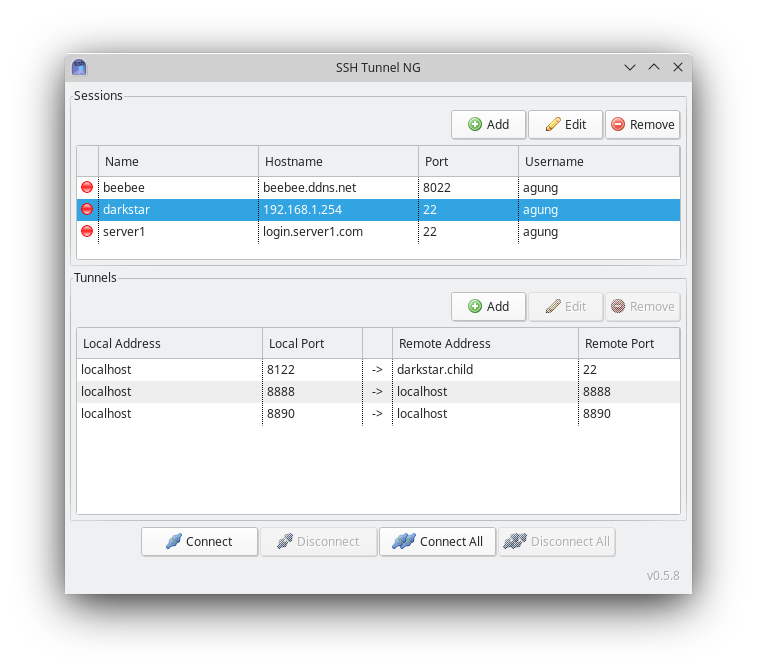

# SSH Tunnel NG

A user-friendly, fast, and cross-platform SSH tunnel manager.

SSH Tunnel NG is the next generation of the [discontinued SSH Tunnel](https://github.com/jfifield/sshtunnel).

What is SSH tunneling? \
https://en.wikipedia.org/wiki/Tunneling_protocol#Secure_Shell_tunneling \
https://www.ssh.com/academy/ssh/tunneling

## Features

1. Manage multiple sessions and tunnels
2. Local and remote tunnels supported
3. Bind local ports to any local address
4. Basic username/password and private key authentications
5. Configurable encryption ciphers
6. Enable/disable compression
7. Quick connect/disconnect from tray
8. Background connection monitoring (automatic reconnection; no hanging sessions)
9. Lightweight (it has a small memory footprint of ~16 MB RAM)
10. Multi-platform (it runs on JVM)
11. Portable or standalone installation (it can be run from an external disk or a USB flash drive)

## Download

### Latest version

* [Linux x86-64](https://github.com/agung-m/sshtunnel-ng/releases/download/0.6.0/sshtunnel-ng-0.6.0-dist-linux-64.zip)
* [Windows 64-bit](https://github.com/agung-m/sshtunnel-ng/releases/download/0.6.0/sshtunnel-ng-0.6.0-dist-windows-64.zip)

## Requirements

Java Runtime Environment (JRE) 8.0 or newer

## License

[Apache License, Version 2.0](http://www.apache.org/licenses/LICENSE-2.0)

## Contact
hello@agungmulya.com

--------------------------------------------------------------------------------

## Building

  For the current platform:

  `mvn clean assembly:single`

  For a different platform for example:

  `mvn -P +linux,-windows clean assembly:single`

  Supported platforms: windows, windows-64, linux, linux-64

## Running

  Unzip the target distribution.

  `java -jar sshtunnel-ng-{VERSION}.jar`

## Changes
See [Releases](https://github.com/agung-m/sshtunnel-ng/releases).
